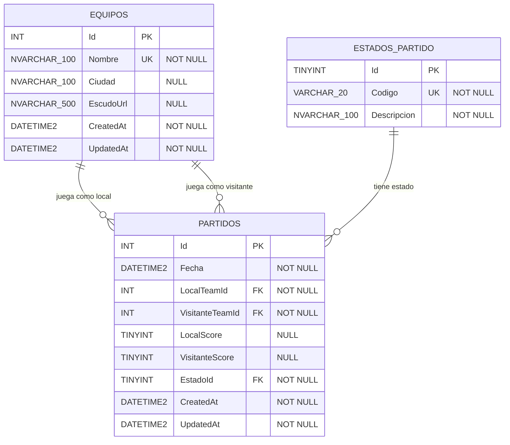

# scripts/db/

Scripts SQL Server para crear, poblar y mantener la base de datos `FutbolManagerDb`.

## Orden de ejecución

| # | Archivo                    | Descripción                                                     |
| - | -------------------------- | --------------------------------------------------------------- |
| 0 | `00_create_database.sql`   | Crea la base de datos (si no existe) y selecciona contexto.     |
| 1 | `01_schema.sql`            | Tablas, PK, FK, CHECK, UNIQUE, INDEX y triggers de auditoría.   |
| 2 | `02_seed.sql`              | Catálogo `EstadosPartido` (datos maestros, IDs reservados).     |
| 3 | `03_views.sql`             | Vista `vw_TablaPosiciones` + SP `sp_ObtenerTablaPosiciones`.    |
| 9 | `99_drop_database.sql`     | Eliminación completa (solo en entornos no productivos).         |

Ejecutar con `sqlcmd`:

```powershell
sqlcmd -S localhost -E -i scripts\db\00_create_database.sql
sqlcmd -S localhost -E -d FutbolManagerDb -i scripts\db\01_schema.sql
sqlcmd -S localhost -E -d FutbolManagerDb -i scripts\db\02_seed.sql
sqlcmd -S localhost -E -d FutbolManagerDb -i scripts\db\03_views.sql
```

---

## Modelo lógico

### Diagrama relacional (Mermaid ER)



### Diagrama ASCII (alternativa)

```
┌──────────────────────────────┐         ┌─────────────────────────────────┐
│         Equipos              │         │       EstadosPartido            │
├──────────────────────────────┤         ├─────────────────────────────────┤
│ Id            INT       PK   │         │ Id          TINYINT       PK    │
│ Nombre        NVARCHAR  UQ   │         │ Codigo      VARCHAR(20)   UQ    │
│ Ciudad        NVARCHAR  NULL │         │ Descripcion NVARCHAR(100)       │
│ EscudoUrl     NVARCHAR  NULL │         │ CreatedAt   DATETIME2           │
│ CreatedAt     DATETIME2      │         └────────────────┬────────────────┘
│ UpdatedAt     DATETIME2      │                          │
└──────┬───────────────────┬───┘                          │
       │                   │                              │
       │ LocalTeamId       │ VisitanteTeamId              │ EstadoId
       │                   │                              │
       ▼                   ▼                              ▼
       ┌─────────────────────────────────────────────────────┐
       │                       Partidos                       │
       ├─────────────────────────────────────────────────────┤
       │ Id              INT          PK                       │
       │ Fecha           DATETIME2                             │
       │ LocalTeamId     INT          FK → Equipos.Id          │
       │ VisitanteTeamId INT          FK → Equipos.Id          │
       │ LocalScore      TINYINT      NULL (hasta jugarse)     │
       │ VisitanteScore  TINYINT      NULL                     │
       │ EstadoId        TINYINT      FK → EstadosPartido.Id   │
       │ CreatedAt       DATETIME2                             │
       │ UpdatedAt       DATETIME2                             │
       │                                                       │
       │ CHECK: LocalTeamId <> VisitanteTeamId                 │
       │ CHECK: Scores >= 0                                    │
       │ CHECK: Si Estado=Jugado ⇒ Scores NOT NULL             │
       └─────────────────────────────────────────────────────┘
```

---

## Decisiones de diseño

### 1. Catálogo `EstadosPartido` en lugar de enum/CHECK

Usar una tabla maestra (en vez de `CHECK (Estado IN ('Programado',...))`) cumple **3FN** de manera estricta, permite agregar metadatos por estado (descripción, color, flags) sin alterar tablas hijas, y facilita la internacionalización.

Los IDs son **reservados y fijos** (`1=Programado`, `2=Jugado`, `3=Suspendido`, `4=Cancelado`) para poder referenciarlos desde `CHECK` constraints sin subqueries.

### 2. `Scores` nullables

Un partido `Programado` no tiene marcador todavía. Permitir `NULL` evita inventar valores centinela (`-1`) que ensucian agregaciones. Un `CHECK` exige que cuando `EstadoId = 2 (Jugado)`, ambos marcadores estén informados.

### 3. Tabla de posiciones como **vista**, no como tabla

`PJ`, `PG`, `PE`, `PP`, `GF`, `GC`, `DG`, `PTS` son **derivables** de `Partidos`. Materializarlas violaría 3FN (dependencia transitiva) y abriría riesgo de inconsistencia. Se expone como:

* `vw_TablaPosiciones` — vista con los agregados por equipo (sin ordenar).
* `sp_ObtenerTablaPosiciones` — SP que aplica el orden por desempates.

### 4. Auditoría: `CreatedAt` + `UpdatedAt`

* `CreatedAt`: `DEFAULT SYSUTCDATETIME()`.
* `UpdatedAt`: trigger `AFTER UPDATE` que la refresca automáticamente.
* Se usa **UTC** (`SYSUTCDATETIME()`) para evitar problemas con zonas horarias y horario de verano.

### 5. 3FN

* Cada atributo no-clave depende **solo** de la PK.
* Sin dependencias transitivas: el nombre de un estado vive solo en `EstadosPartido` y se referencia por FK.
* Los agregados de la tabla de posiciones **no se almacenan** (son derivados).

### 6. Índices

| Índice                                    | Justificación                                       |
| ----------------------------------------- | --------------------------------------------------- |
| `UQ_Equipos_Nombre`                       | Evita duplicados de nombre de equipo.               |
| `UQ_EstadosPartido_Codigo`                | Catálogo: cada código es único.                     |
| `IX_Partidos_Fecha`                       | Calendario por fecha.                               |
| `IX_Partidos_LocalTeamId`                 | Listar partidos de un equipo (local).               |
| `IX_Partidos_VisitanteTeamId`             | Listar partidos de un equipo (visitante).           |
| `IX_Partidos_EstadoId`                    | Filtrar por estado.                                 |
| `IX_Partidos_Jugados` *(filtrado)*        | Optimiza la vista de posiciones (solo `Jugado`).    |

---

## Reglas de tabla de posiciones

| Resultado | Puntos |
| --------- | ------ |
| Victoria  | 3      |
| Empate    | 1      |
| Derrota   | 0      |

### Orden por desempates (implementado en `sp_ObtenerTablaPosiciones`)

1. `PTS` desc
2. `DG` desc *(diferencia de goles)*
3. `GF` desc *(goles a favor)*
4. **Head-to-head** — **no implementado**, ver nota.

### Head-to-head — nota de implementación

El criterio de "head-to-head" (resultado directo entre los equipos empatados) **no es expresable de forma robusta dentro de un único `ORDER BY`** en SQL Server porque:

* Solo aplica cuando hay **2 o más equipos empatados** en los criterios anteriores.
* El subconjunto de partidos relevantes cambia según qué equipos estén empatados, por lo que no es una función de fila.
* Si hay un empate múltiple (≥3 equipos), el cálculo se hace **solo entre ellos**, no contra todos.

Estrategia recomendada (a implementar en la capa Application, no en la BD):

1. Obtener la tabla de posiciones desde `vw_TablaPosiciones`.
2. Agrupar equipos cuyos `(PTS, DG, GF)` coincidan.
3. Para cada grupo de ≥2 equipos, recalcular `PTS / DG / GF` usando **solo** los partidos jugados **entre ellos**.
4. Aplicar de forma recursiva si persiste el empate; finalmente desempatar por orden alfabético.

> Documentado aquí para que el equipo lo implemente con tests dedicados en Application.

---

## Convenciones de nombres

| Objeto       | Patrón                                    | Ejemplo                                |
| ------------ | ----------------------------------------- | -------------------------------------- |
| Tabla        | PascalCase plural                         | `Equipos`, `Partidos`                  |
| PK           | `Id` simple                               | `Equipos.Id`                           |
| FK           | `{Entidad}Id`                             | `LocalTeamId`, `EstadoId`              |
| PK constraint | `PK_{Tabla}`                             | `PK_Equipos`                           |
| FK constraint | `FK_{Tabla}_{TablaRef}_{Columna}`        | `FK_Partidos_Equipos_LocalTeamId`      |
| UNIQUE       | `UQ_{Tabla}_{Columna}`                    | `UQ_Equipos_Nombre`                    |
| CHECK        | `CK_{Tabla}_{Regla}`                      | `CK_Partidos_EquiposDistintos`         |
| Index        | `IX_{Tabla}_{Columnas}`                   | `IX_Partidos_Fecha`                    |
| Trigger      | `TR_{Tabla}_{Evento}_{Accion}`            | `TR_Equipos_AfterUpdate_UpdatedAt`     |
| Vista        | `vw_{Nombre}`                             | `vw_TablaPosiciones`                   |
| Procedure    | `sp_{Nombre}`                             | `sp_ObtenerTablaPosiciones`            |
